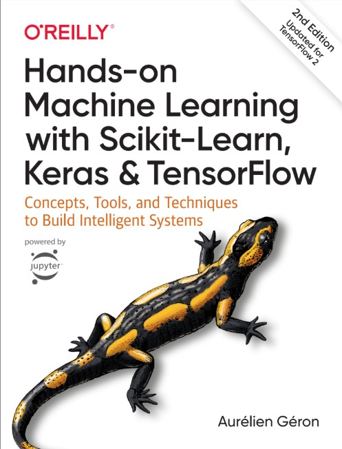

# Hands-On Machine Learning with Scikit-Learn, Keras, and TensorFlow – Summary

This repository contains notes, code, and experiments based on *Hands-On Machine Learning with Scikit-Learn, Keras, and TensorFlow (2nd Edition)* by Aurélien Géron.[file:1] The book is divided into two main parts: **traditional machine learning** with Scikit-Learn and **deep learning** with TensorFlow/Keras.[file:1]

---

## Part I – The Fundamentals of Machine Learning

Part I introduces the **core concepts, workflow, and classical algorithms** in machine learning.[file:1] It covers problem framing, data preparation, model training, evaluation, tuning, and deployment using Scikit-Learn, while explaining key ideas like overfitting, underfitting, bias–variance trade-off, and regularization.[file:1]

### Brief content

- **Chapter 1 – The Machine Learning Landscape** (p. 1)  
  Overview of ML types (supervised, unsupervised, online, batch), key applications, and fundamental challenges such as overfitting, data quality, and the curse of dimensionality.[file:1]

- **Chapter 2 – End-to-End Machine Learning Project** (p. 35)  
  Full ML pipeline on a housing dataset: exploratory data analysis, feature engineering, data cleaning, train/validation/test splits, model selection, and deployment considerations.[file:1]

- **Chapter 3 – Classification** (p. 85)  
  Binary and multiclass classification with examples like MNIST, using logistic regression, k‑NN, decision scores, ROC/PR curves, precision–recall trade-offs, and error analysis.[file:1]

- **Chapter 4 – Training Models** (p. 111)  
  Linear models for regression and classification, gradient descent variants, polynomial regression, regularization (Ridge, Lasso, Elastic Net), and learning curves.[file:1]

- **Chapter 5 – Support Vector Machines** (p. 153)  
  Linear and kernel SVMs for classification and regression, margin maximization, kernel tricks (RBF, polynomial), and hyperparameter effects.[file:1]

- **Chapter 6 – Decision Trees** (p. 175)  
  CART training, impurity measures (Gini, entropy), tree depth control, visualization and interpretability, and limitations such as high variance.[file:1]

- **Chapter 7 – Ensemble Learning and Random Forests** (p. 189)  
  Bagging, pasting, Random Forests, Extra-Trees, boosting (AdaBoost, Gradient Boosting), stacking, and why ensembles reduce variance and improve robustness.[file:1]

- **Chapter 8 – Dimensionality Reduction** (p. 213)  
  PCA, incremental PCA, randomized PCA, kernel PCA, and manifold learning (LLE), plus discussion of information loss and visualization of high-dimensional data.[file:1]

- **Chapter 9 – Unsupervised Learning Techniques** (p. 235)  
  Clustering (k‑means, hierarchical, DBSCAN), anomaly detection, density estimation, and mixture models, with practical guidance on choosing and evaluating unsupervised methods.[file:1]

---

## Part II – Neural Networks and Deep Learning

Part II focuses on **neural networks and deep learning**, using TensorFlow and Keras to build and train modern deep models for vision, sequences, NLP, generative modeling, RL, and large-scale deployment.[file:1]

### Brief content

- **Chapter 10 – Introduction to Artificial Neural Networks with Keras** (p. 279)  
  Perceptrons, feedforward networks, activation functions, loss functions, and building dense networks with Keras (Sequential and Functional APIs) for classification and regression.[file:1]

- **Chapter 11 – Training Deep Neural Networks** (p. 331)  
  Key training techniques: initialization, optimizers (Momentum, RMSProp, Adam), batch normalization, dropout, early stopping, learning rate schedules, and handling vanishing/exploding gradients.[file:1]

- **Chapter 12 – Custom Models and Training with TensorFlow** (p. 375)  
  TensorFlow 2 fundamentals: `tf.function`, custom layers and models, subclassing `Model`, custom training loops with GradientTape, and serving/exporting models.[file:1]

- **Chapter 13 – Loading and Preprocessing Data with TensorFlow** (p. 413)  
  Input pipelines with `tf.data`: reading from CSV/TFRecord, batching, shuffling, prefetching, parallel mapping, feature columns, and efficient large-scale data input.[file:1]

- **Chapter 14 – Deep Computer Vision Using Convolutional Neural Networks** (p. 445)  
  CNN building blocks (convolution, pooling, padding, stride), classic architectures (LeNet, AlexNet, VGG, ResNet, Inception), transfer learning, fine-tuning, and data augmentation.[file:1]

- **Chapter 15 – Processing Sequences Using RNNs and CNNs** (p. 497)  
  Sequence modeling with RNNs (SimpleRNN, LSTM, GRU), bidirectional and stacked RNNs, 1D CNNs for sequences, encoder–decoder, and handling long-term dependencies.[file:1]

- **Chapter 16 – Natural Language Processing with RNNs and Attention** (p. 525)  
  Character- and word-level models, embeddings, sentiment analysis, sequence-to-sequence for translation, attention mechanisms (Bahdanau, Luong), and the Transformer architecture.[file:1]

- **Chapter 17 – Representation Learning and Generative Learning Using Autoencoders and GANs** (p. 567)  
  Autoencoders (undercomplete, denoising, sparse, stacked), variational autoencoders, GANs (vanilla GAN, DCGAN, conditional GAN), and advanced designs like Progressive GAN and StyleGAN.[file:1]

- **Chapter 18 – Reinforcement Learning** (p. 609)  
  RL fundamentals (agent, environment, rewards, returns, discounting, MDPs), policy gradients, value-based methods (Q-learning, DQN and variants), and TF-Agents for Atari-style problems.[file:1]

- **Chapter 19 – Training and Deploying TensorFlow Models at Scale** (p. 667)  
  Model serving with TF Serving and REST/gRPC, SavedModel format, TensorFlow Lite and TF.js for edge/web, GPU utilization, and distributed training with distribution strategies (Mirrored, MultiWorker, parameter servers, TPUs).[file:1]

---

## Core ML Concepts and Techniques

This book covers a wide range of **machine learning and deep learning topics**, organized by chapter:[file:1]

- The Machine Learning Landscape (Ch. 1)  
- End-to-End Machine Learning Project (Ch. 2)  
- Classification (Ch. 3)  
- Training Models (Ch. 4)  
- Support Vector Machines (Ch. 5)  
- Decision Trees (Ch. 6)  
- Ensemble Learning and Random Forests (Ch. 7)  
- Dimensionality Reduction (Ch. 8)  
- Unsupervised Learning Techniques (Ch. 9)  
- Introduction to Artificial Neural Networks with Keras (Ch. 10)  
- Training Deep Neural Networks (Ch. 11)  
- Custom Models and Training with TensorFlow (Ch. 12)  
- Loading and Preprocessing Data with TensorFlow (Ch. 13)  
- Deep Computer Vision Using Convolutional Neural Networks (Ch. 14)  
- Processing Sequences Using RNNs and CNNs (Ch. 15)  
- Natural Language Processing with RNNs and Attention (Ch. 16)  
- Representation Learning and Generative Learning Using Autoencoders and GANs (Ch. 17)  
- Reinforcement Learning (Ch. 18)  
- Training and Deploying TensorFlow Models at Scale (Ch. 19)[file:1]

---

## ML and DL Toolkits / Libraries Used

The book uses a consistent set of **Python libraries** to implement concepts and projects:[file:1]

- **Scikit-Learn** – Chapters 1–9  
  Classic ML algorithms, model selection, preprocessing, and pipelines.[file:1]

- **TensorFlow** – Chapters 10–19  
  Deep learning core, low-level ops, custom training loops, distribution strategies, and deployment.[file:1]

- **Keras (`tf.keras`)** – Chapters 10–17  
  High-level API for building, training, and exporting neural networks (dense, CNNs, RNNs, attention, autoencoders, GANs).[file:1]

- **NumPy** – Throughout  
  Numerical operations, arrays, random sampling, and linear algebra helpers.[file:1]

- **Pandas** – Especially Chapters 2, 9, 13  
  Tabular data loading, cleaning, feature engineering, and exploratory analysis.[file:1]

- **Matplotlib / Seaborn** – Especially Chapters 2, 4–8  
  Visualization of data, model performance, learning curves, and decision boundaries.[file:1]

- **OpenAI Gym & TF-Agents** – Chapter 18  
  RL environments (CartPole, Atari) and high-level RL components (agents, replay buffers, policies).[file:1]

---

## What You’ll Learn

By following the book and this repository, you will:[file:1]

- **Master fundamental ML concepts**  
  Understand supervised vs. unsupervised learning, key algorithms (linear models, trees, ensembles, SVMs), and core notions like bias–variance, regularization, and evaluation metrics.[file:1]

- **Build end-to-end ML workflows**  
  Go from raw data to production-ready models: data preprocessing, pipeline design, model tuning, validation, and deployment.[file:1]

- **Gain proficiency with major libraries**  
  Become comfortable using Scikit-Learn, TensorFlow, Keras, Pandas, and visualization tools to implement real-world ML systems.[file:1]

- **Apply advanced deep learning techniques**  
  Design and train neural networks for computer vision, sequence modeling, NLP, generative modeling, and reinforcement learning, including attention and Transformers.[file:1]

- **Scale and deploy models in production**  
  Serve models via web APIs, deploy to mobile/web/embedded environments, and leverage GPUs/TPUs and distributed training strategies for large workloads.[file:1]

> By the end, you will be able to **design, train, evaluate, and deploy** machine learning and deep learning solutions for tasks such as classification, regression, computer vision, NLP, generative modeling, and large-scale production systems.[file:1]
